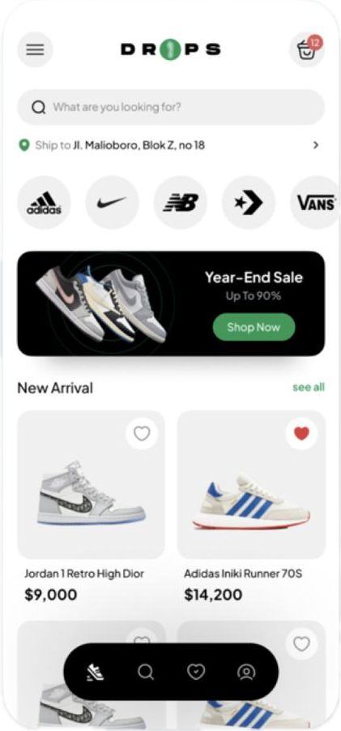

Ufak bir fikir olsun, Icon olarak bunları kullanmanız gerek:
•Icons.shopping_card_outlined
•Icons.menu
•Icons.location_pin
•Icons.favorite
•Icons.favorite_border
•Icons.chevron_right
•Icons.search

Ana tema olarak kullabileceğiniz renk kodları:
•Yeşil: #159953
•Mavi: #4273ED

(Tasarım https://dribbble.com/DaffaToldo’ya ait)
•Flutter Map (Widgetların nasıl çalıştığını gösterip bazı taktikler veriyor) : https://youtube.com/@FlutterMapp
•dbestech (UI/UX tasarımı ve packageları gösteriyor) : https://youtube.com/@dbestech
•afgprogrammer (UI/UX ve animation) : https://youtube.com/@Afgprogrammer
•HeyFlutter.com (UI/UX backend çoğu şey var) : https://youtube.com/@HeyFlutter
•The Flutter Way (her videosu sanat eseri) : https://youtube.com/@TheFlutterWay

